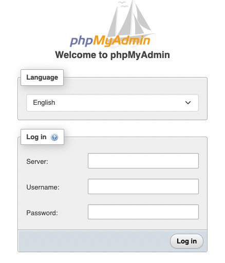
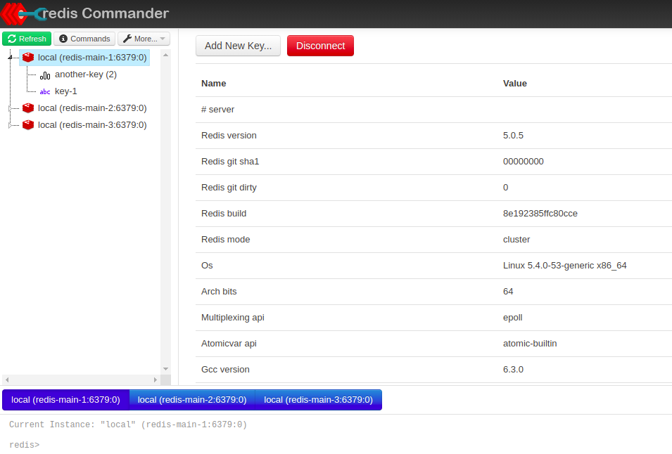

# Savi developer platform

Developer environment with utilities to start the savi coupons platform using docker-compose.

To run the commands you must use the command make, there are few commands to help you start working. Have a look to the file [Makefile](./Makefile) 

The platform use the following services

- Mysql
- Redis
- Elasticsearch stack

## Prerequisites

- Install docker and docker compose
- Install git

## Working with the dev environment

Run the following command to start all the services

```shell
make docker-compose-up
```

Start mysql and redis
```shell
make docker-compose-up-db
```

Start ELK services
```shell
make docker-compose-up-db
```

Run the following command to stop and remove all the services

```shell
make docker-compose-down
```

Stop mysql and redis
```shell
make docker-compose-up-db
```

Stop ELK services
```shell
make docker-compose-up-db
```

## Generate database diagrams

Once you have started the developer platform you can generated the ER diagram from the schema of the euomf database 
in markdown or pdf format running:

PDF:
```shell
make mysql-mermaid-generate-diagram-md
```

Markdown:
```shell
make mysql-mermaid-generate-diagram-md
```

The output files can be found in generated folder

## Services

### mysql

Database accessible in localhost port 3306.

Access with user:
- root without password
- user with password 'welovecoupons'

The sql files in the folder init are a hard link to the files in the folder ../sql. The name contains a numeric prefix
to define the order in which the files are loaded in the database the first time the my-db volume is used.  

### phpmyadmin

(phpMyAdmin)[https://www.phpmyadmin.net/] is a free software tool written in PHP, intended to handle the administration 
of MySQL over the Web

Access to [pma](http://localhost:8081/)

Fill the fields with the following values



- Server: localhost
- Username: root
- Password: <empty>

### redis

Redis is an open source (BSD licensed), in-memory data structure store, used as a database, cache, and message broker.

Expose on [localhost:6379](http://localhost:6379)

### redis-commander

Redis web management tool written in node.js



### Kibana

Kibana is a free and open user interface that lets you visualize your Elasticsearch data and navigate the Elastic Stack. Do anything from tracking query load to understanding the way requests flow through your apps.

Expose on [localhost:5601](http://localhost:5601)

### logstash

### cerebro

[cerebro](https://github.com/lmenezes/cerebro) is an open source(MIT License) elasticsearch web admin tool built using
Scala, Play Framework, AngularJS and Bootstrap.

Access to [cerebro](https://github.com/lmenezes/cerebro)

