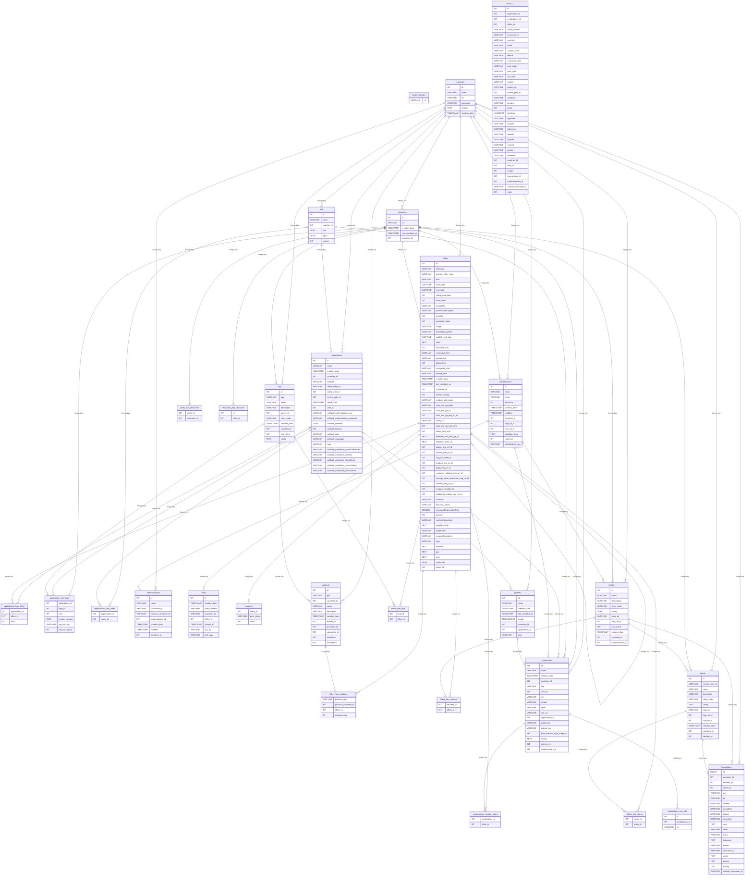

```mermaid

erDiagram

  breach_hashes {
    VARCHAR id
  }

  countries {
    INT id
    VARCHAR name
    VARCHAR tld
    VARCHAR password
    TEXT settings
    TIMESTAMP creation_date
  }

  prints_2 {
    INT id
    INT applications_id
    INT syndications_id
    INT offers_id
    VARCHAR client_address
    VARCHAR consumer_id
    VARCHAR currency
    VARCHAR serial
    VARCHAR custom_serial
    VARCHAR remark
    VARCHAR consumer_uuid
    VARCHAR print_status
    VARCHAR print_type
    VARCHAR zip_code
    VARCHAR context
    DATETIME printed_on
    INT master_print_id
    DATETIME validUntil
    DATETIME pending
    INT probe
    LONGTEXT formData
    DATETIME approved
    DATETIME inquired
    DATETIME redeemed
    DATETIME revoked
    DATETIME updated
    DATETIME created
    DATETIME printed
    DATETIME delivered
    INT countries_id
    INT user_id
    BIT scopes
    INT transactions_id
    INT authentications_id
    VARCHAR valassis_consumer_id
    INT value
  }

  resources {
    INT id
    VARCHAR url
    TIMESTAMP creation_date
    TIMESTAMP last_modified_on
    INT countries_id
  }

  user {
    INT id
    VARCHAR name
    INT countries_id
    TEXT role
    JSON rights
    INT scopes
  }

  applications {
    INT id
    VARCHAR name
    TIMESTAMP creation_date
    INT countries_id
    VARCHAR callback
    VARCHAR latest_event_id
    INT latest_print_id
    INT current_print_id
    TIMESTAMP latest_print
    INT user_id
    VARCHAR callback_authentication_user
    VARCHAR callback_authentication_password
    JSON callback_headers
    INT callback_timeout
    VARCHAR callback_type
    VARCHAR callback_outputtype
    VARCHAR type
    VARCHAR callback_salesforce_accessTokenURL
    VARCHAR callback_salesforce_clientId
    VARCHAR callback_salesforce_clientSecret
    VARCHAR callback_salesforce_accessToken
    VARCHAR callback_salesforce_instanceURL
  }

  authenticators {
    INT id
    VARCHAR name
    VARCHAR driver
    BIT exclusive
    TIMESTAMP creation_date
    TIMESTAMP modified
    INT countries_id
    INT logo_url_id
    INT icon_url_id
    TEXT validation_type
    BIT redeemer
    VARCHAR identification_type
  }

  offers {
    INT id
    VARCHAR offercode
    VARCHAR provider_offer_code
    VARCHAR ean
    DATETIME start_date
    DATETIME end_date
    INT rolling_end_date
    INT face_value
    VARCHAR description
    VARCHAR printProviderTagline
    INT quantity
    INT purchase_value
    VARCHAR usage
    VARCHAR description_gallery
    DATETIME publish_end_date
    TEXT limits
    INT individual_limit
    VARCHAR renewable_limit
    VARCHAR periodLimit
    INT global_limit
    VARCHAR consumer_note
    VARCHAR retailer_note
    TIMESTAMP creation_date
    TIMESTAMP last_modified_on
    INT countries_id
    BIT details_sharing
    VARCHAR product_information
    VARCHAR click_and_go_label
    VARCHAR click_and_go_url
    INT click_and_go_img_url_id
    VARCHAR video_url
    INT click_and_go_click_limit
    INT video_click_limit
    TEXT effective_click_and_go_url
    TEXT effective_video_url
    INT gallery_img_url_id
    INT canvas_img_url_id
    INT img_url_wallet_id
    INT product_img_url_id
    INT page_img_url_id
    INT customer_cobrand_img_url_id
    INT savings_value_watermark_img_url_id
    INT retailers_img_url_id
    INT coupon_template_id
    INT additional_product_img_url_id
    VARCHAR currency
    VARCHAR discount_JSON
    DECIMAL estimatedRedemptionRate
    BIT paused
    VARCHAR cashierInstructions
    TEXT templateFonts
    VARCHAR pageFooter
    VARCHAR couponDescription
    VARCHAR type
    TEXT barcode
    TEXT gpc
    TEXT form
    JSON collections
    INT target_id
  }

  prints_has_resources {
    INT prints_id
    INT resources_id
  }

  resources_has_resources {
    INT id
    INT child_id
  }

  tags {
    INT id
    VARCHAR type
    VARCHAR name
    VARCHAR description
    INT parent_id
    VARCHAR client_code
    TIMESTAMP creation_date
    INT countries_id
    INT icon_url_id
    TEXT config
  }

  applications_has_offers {
    INT applications_id
    INT offers_id
    INT rank
  }

  applications_has_tags {
    INT applications_id
    INT tags_id
    INT rank
    TEXT custom_content
    VARCHAR tag_icon_url
    INT tag_icon_url_id
  }

  applications_has_users {
    INT applications_id
    INT users_id
  }

  authentications {
    INT id
    VARCHAR name
    VARCHAR consumer_id
    VARCHAR valassis_consumer_id
    INT authenticators_id
    TIMESTAMP creation_date
    TIMESTAMP modified
    INT countries_id
  }

  clicks {
    INT id
    TIMESTAMP creation_date
    VARCHAR client_address
    VARCHAR consumer_id
    INT offers_id
    TIMESTAMP clicked_on
    VARCHAR syn_src
    VARCHAR click_type
  }

  counters {
    INT offers_id
    VARCHAR print_status
    INT value
  }

  galleries {
    INT id
    VARCHAR name
    TIMESTAMP creation_date
    TIMESTAMP last_modified_on
    MEDIUMTEXT config
    INT countries_id
    INT applications_id
    VARCHAR type
  }

  offers_has_tags {
    INT tags_id
    INT offers_id
  }

  products {
    INT id
    VARCHAR gtin
    INT countries_id
    VARCHAR name
    VARCHAR description
    TIMESTAMP creation_date
    INT brands_id
    INT providers_id
    INT categories_id
    INT retailPrice
    INT maxRefund
  }

  retailers {
    INT id
    VARCHAR name
    VARCHAR description
    VARCHAR client_code
    TEXT config
    VARCHAR shop_url
    INT logo_url_id
    INT icon_url_id
    TIMESTAMP creation_date
    INT countries_id
    INT authenticators_id
  }

  offers_has_products {
    VARCHAR products_gtin
    INT products_countries_id
    INT offers_id
    BIT required_only
  }

  offers_has_retailers {
    INT retailers_id
    INT offers_id
  }

  stores {
    INT id
    VARCHAR remote_store_id
    VARCHAR name
    VARCHAR description
    VARCHAR client_code
    TEXT config
    VARCHAR shop_url
    INT logo_url_id
    INT icon_url_id
    TIMESTAMP creation_date
    INT countries_id
    INT retailers_id
  }

  syndications {
    INT id
    VARCHAR name
    TIMESTAMP creation_date
    INT countries_id
    VARCHAR key
    INT user_id
    VARCHAR url
    VARCHAR details
    VARCHAR label
    VARCHAR syn_url
    INT applications_id
    VARCHAR public_key
    VARCHAR private_key
    INT print_provider_logo_image_id
    TEXT config
    INT galleries_id
    INT authenticators_id
  }

  offers_has_stores {
    INT stores_id
    INT offers_id
  }

  syndications_exclude_offers {
    INT syndications_id
    INT offers_id
  }

  syndications_has_urls {
    INT id
    INT syndications_id
    VARCHAR url
  }

  transactions {
    BIGINT id
    INT countries_id
    INT retailers_id
    INT stores_id
    VARCHAR pos
    VARCHAR tid
    DATETIME created
    DATETIME completed
    DATETIME closed
    DATETIME cancelled
    TEXT uccs
    VARCHAR state
    VARCHAR extra
    TEXT discounts
    VARCHAR reason
    VARCHAR consumer_id
    TEXT cards
    TEXT basket
    TEXT history
    VARCHAR valassis_consumer_id
  }


  countries ||--o{ applications : "foreign key"
  countries ||--o{ authentications : "foreign key"
  countries ||--o{ authenticators : "foreign key"
  countries ||--o{ galleries : "foreign key"
  countries ||--o{ offers : "foreign key"
  countries ||--o{ products : "foreign key"
  countries ||--o{ resources : "foreign key"
  countries ||--o{ retailers : "foreign key"
  countries ||--o{ stores : "foreign key"
  countries ||--o{ syndications : "foreign key"
  countries ||--o{ tags : "foreign key"
  countries ||--o{ transactions : "foreign key"
  countries ||--o{ user : "foreign key"


  resources ||--o{ applications_has_tags : "foreign key"
  resources ||--o{ authenticators : "foreign key"
  resources ||--o{ offers : "foreign key"
  resources ||--o{ prints_has_resources : "foreign key"
  resources ||--o{ resources_has_resources : "foreign key"
  resources ||--o{ retailers : "foreign key"
  resources ||--o{ stores : "foreign key"
  resources ||--o{ syndications : "foreign key"
  resources ||--o{ tags : "foreign key"

  user ||--o{ applications : "foreign key"
  user ||--o{ applications_has_users : "foreign key"
  user ||--o{ syndications : "foreign key"

  applications ||--o{ applications_has_offers : "foreign key"
  applications ||--o{ applications_has_tags : "foreign key"
  applications ||--o{ applications_has_users : "foreign key"
  applications ||--o{ galleries : "foreign key"
  applications ||--o{ syndications : "foreign key"

  authenticators ||--o{ authentications : "foreign key"
  authenticators ||--o{ retailers : "foreign key"
  authenticators ||--o{ syndications : "foreign key"

  offers ||--o{ applications_has_offers : "foreign key"
  offers ||--o{ clicks : "foreign key"
  offers ||--o{ counters : "foreign key"
  offers ||--o{ offers : "foreign key"
  offers ||--o{ offers_has_products : "foreign key"
  offers ||--o{ offers_has_retailers : "foreign key"
  offers ||--o{ offers_has_stores : "foreign key"
  offers ||--o{ offers_has_tags : "foreign key"
  offers ||--o{ syndications_exclude_offers : "foreign key"


  tags ||--o{ applications_has_tags : "foreign key"
  tags ||--o{ offers_has_tags : "foreign key"
  tags ||--o{ products : "foreign key"


  galleries ||--o{ syndications : "foreign key"


  products ||--o{ offers_has_products : "foreign key"

  retailers ||--o{ offers_has_retailers : "foreign key"
  retailers ||--o{ stores : "foreign key"
  retailers ||--o{ transactions : "foreign key"


  stores ||--o{ offers_has_stores : "foreign key"
  stores ||--o{ transactions : "foreign key"

  syndications ||--o{ syndications_exclude_offers : "foreign key"
  syndications ||--o{ syndications_has_urls : "foreign key"


```
